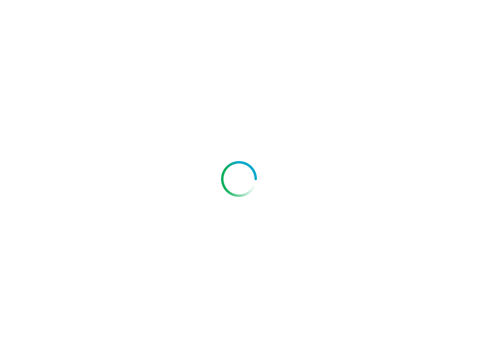

<!doctype html>
<html class="no-js" lang="">

<head>
    <meta charset="utf-8">
    <meta http-equiv="x-ua-compatible" content="ie=edge">
    <title>Matin Hassanloo - Coming Soon</title>
    <meta name="description" content="">
    <meta name="viewport" content="width=device-width, initial-scale=1">
    <!-- Favicon -->
    <link rel="shortcut icon" type="image/x-icon" href="img/favicon.png">
    <!-- Bootstrap CSS -->
    <link rel="stylesheet" href="css/bootstrap.min.css">
    <!-- Fontawesome CSS -->
    <link rel="stylesheet" href="css/fontawesome-all.min.css">
    <!-- Custom Animation CSS -->
    <link rel="stylesheet" href="css/fxt-animation.css">
    <!-- Custom CSS -->
    <link rel="stylesheet" href="css/style.css">
    <!-- Google Font -->
    <link href="https://fonts.googleapis.com/css2?family=Poppins:wght@300;400;500;600;700&amp;display=swap" rel="stylesheet">
</head>

<body>
    <!-- Page Loader Start -->
	

        
    

	<!-- Page Loader End --> 
    

        

            <!-- Background Parallax Start Here -->
            

            <!-- Background Parallax End Here -->
            <!-- Main Content Start Here -->
            

                

                
  
                
My website is
 
                <h1 class="fxt-main-title translate-bottom-50 transition-100 transition-delay-600">COMING SOON!</h1>
                <ul class="fxt-btn-group translate-zoomout-10 transition-100 transition-delay-1000">
                    <li class="fxt-single-item">
                        <button type="button" class="fxt-btn-fill" data-toggle="modal" data-target="#notifyMe">NOTIFY ME!</button>            
                    </li>
                </ul>
                

                    <ul>
                        <li class="fxt-twitter translate-top-50 transition-100 transition-delay-1300"><a href="http://twitter.com/maaasker" title="twitter"><i class="fab fa-twitter"></i></a></li>
                        <li class="fxt-linkedin translate-top-50 transition-100 transition-delay-1500"><a href="http://linkedin.com/in/maasker" title="linkedin"><i class="fab fa-linkedin-in"></i></a></li>
                    </ul>
                

                
&copy; 2021 Matin Hassanloo
  
            

            <!-- Main Content End Here -->
        

        <!-- Subscribe Modal Area Start Here -->
        

            

                

                    

                        <button type="button" class="close" data-dismiss="modal" aria-label="Close">
                            &times;
                        </button>
                    

                    

                        

                            <h2 class="item-title">Subscribe</h2>
                            
Enter your email address to get notified when site is ready

                            <form action="" class="fxt-subscribe-form" method="POST" data-pixsaas="newsletter-subscribe">
                                

                                    <input type="email" name="email" class="form-control" id="newsletter-form-email" placeholder="Enter your Email">
                                    <button type="submit" class="fxt-btn-fill fxt-btn-style2">SUBMIT</button>                                    
                                

                                

                                    

                                

                            </form>
                        

                    

                

            

        

        <!-- Subscribe Modal Area End Here -->
    

    <!-- jquery-->
        
    <!-- Popper js -->
    
    <!-- Bootstrap js -->
    
    <!-- Imagesloaded js -->
      
    <!-- Parallax js -->
      
    <!-- Validator js -->
    
    <!-- Custom Js -->
    

</body>

</html>
